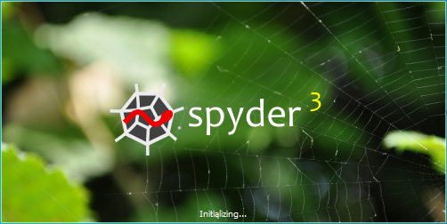

# Introduction

Here in this tutorial, we will create a very simple Python application that can be really useful in various business cases. It will be a simple application, because user can use it through the command prompt window. If you are not looking for fancy GUIs, you can construct your easy-peasy Python application right away and it can make your life a lot easier. You can give up preparing the same analysis over and over again, with different input parameters and save a great deal of your efforts in the long run.

I will rely on a single example throughout the tutorial and before diving deeper into it, I would like to talk about a business scenario where we need a simple currency exchange rate analysis to get things going with our daily operations at work.

Suppose, I am interested in getting an idea of where €/$ exchange rate can move in some future and I would like to simulate it daily using Geometric Brownian Motion(GBM). At the end, I can calculate my risk due to currency movements. So, what I need to do is the following.

1. Decide how far to go back in the past and get €/$ rate to calculate daily volatility to be used in GBM algorithm,
2. Decide how far into the future our simulations should go,
3. Decide how many different future scenarios we would like to have,
4. (optional) If I want to try different scenarios based on some daily volatility assumptions other than the historical one, I should be able to enter a daily volatility value manually

Above four decisions are input to our simulation algorithm and we want users to be able to appropriately provide them to our program and get the results. In our case, we have two output files:

1. Number of scenarios(supplied by the user) many simulated forward €/$ rates as xlsx, and
2. Line graph of the simulated rates over all the scenarios as png

In order to make this a stand-alone desktop application, first, we need to create a virtual python environment and install all the required packages that our program uses. Then, we can write the script, but the important thing here is to set our Desktop path(or a folder in Desktop) as the working directory in our code. So, all the operations take place on our Desktop or a user-created folder on Desktop, and the user can have access to the output files.

Below, you can see the steps we will follow in the tutorial.

# Steps

1. Creating virtual python environment
2. Installing packages to the virtual environment
3. Creating the script  
    3.1. Setting Desktop folder as the working directory  
    3.2. Getting input from the user  
    3.3. Retrieving exchange rate data from Quandl  
    3.4. GBM Algorithm  
    3.5. Plotting the simulated rates and creating .png  
    3.6. Writing the scenarios into .xlsx using xlsxwriter  
    3.7. Collecting the output files into a folder  
    3.8. Re-initiating the program  
4. Creating a shortcut on Desktop for the app  
5. Example run  

## 1. Creating virtual python environment

Before creating the virtual environment, you have to make sure that you have a working Python installation and it is in the Path. You can download it from https://www.python.org/downloads/ and during the installation you can add python to the Path variable by checking the appropriate box on the installation screen when it appears (I believe it is the first screen). If you have a python installation, but it is not in the path, you can add it by:
- Control Panel -> System and Security -> System -> Advanced System Settings -> "Environment Variables" (under "Advanced" tab) -> Select "Path" variable under "System variables" box -> Click "Edit" -> Click "New"  
You need to copy and paste two directories:
1. path_to_python\Python37 -> You can edit this with where your Python is installed
2. path_to_python\Python37\Scripts  


Then, python gets in the Path and we are ready to create a virtual environment.

Now, we need to create an empty folder to host our virtual environment. For this tutorial, I create a folder named PythonVEnvs on the desktop and inside it, I create another folder named Python_VEnv_FXsimulator (You can create it anywhere on your computer as long as you have access permission). We can create the virtual environment that is specific to our application, inside Python_VEnv_FXsimulator. For other projects, we can just create other folders and dump virtual environments into them.  

Open a command prompt window and type:  
python -m venv path_to_python_environment  
You can find the documentation on https://docs.python.org/3/library/venv.html


Then, we have a clean virtual environment. Next task is to install required packages.  


## 2. Installing packages to the virtual environment

In this tutorial, we need below packages:  
1. pandas  
2. numpy  
3. matplotlib  -> to plot scenarios against forward dates  
4. xlsxwriter  -> to write exchange rates for scenarios into Excel  
5. datetime  
6. quandl      -> to retrieve exchange rates through quandl python api

In order to install these packages into our newly created virtual environment, we should open the command prompt window in Scripts folder of the directory where we set up the virtual environment (or we can open the command prompt and move to the Scripts folder using cd command). In my case, the directory is:  
  
C:\Users\Umut YILDIZ\Desktop\PythonVEnvs\Python_VEnv_FXsimulator\Scripts  

1. Using cd  

  

2. Opening cmd in the virtual environment  
First, you need to go to the virtual environment folder, then there are two ways to open command prompt window there:  
1. Right-click the mouse while holding shift button, and then select "Open command window here", or  
2. Type "cmd" in the address bar and hit enter  
Here is explanation: https://www.thewindowsclub.com/how-to-open-command-prompt-from-right-click-menu  

  

Then, we need to activate our python environment. We can do that by simply typing "activate"    

  

At this point, we can use the pip package manager to install the required packages and they will be installed into our virtual environment ("path_to_virtual_environment\Lib\site-packages").  

You can install any package by typing:  
pip install package_name  

In our case, we can install all the required packages at once by typing:  
pip install pandas & pip install matplotlib & pip install xlsxwriter & pip install datetime & pip install quandl  

Note that, when we install pandas, the appropriate numpy version comes with it, so we don't need to install it separately.  

  

Just to check if the packages are installed correctly, you can type "python" in the command prompt and import the packages to see whether any error pops up.  

  

If you see the above screen, free of errors, you are good to go with the next steps.  

## 3. Creating the script 

At this point, we have a virtual environment with the required packages installed within. Now, we can build our model in a script. To do that, we need to use an editor and in this tutorial, I use Spyder as the IDE to build our model. You can use Jupyter Notebook, Notepad++, Pycharm, VS, etc (any of them is fine). If you would like to continue using your existing editor, you need to make sure that your script uses the python in the virtual environment we just created as the interpreter. For instance, you can configure that in Spyder under "Tools" -> "Preferences" -> "Python interpreter", as below:

  

For the sake of completeness of this tutorial, I would like to introduce how to install Spyder as if we are just obtaining an editor for the first time. We will install Spyder into our virtual environment, so we won't need to configure the Python interpreter. The interpreter is, by default, python.exe in "Scripts" folder of the virtual environment, since we install Spyder with our virtual environment as the active environment.  
There are mainly two ways to obtain Spyder:  
1. Get it through Anaconda distribution (This is the easiest way!) (https://www.anaconda.com/distribution/)  
In this first method, you will need to configure the Python interpreter as I explained above.
2. Install it through pip package manager (I use this one and I introduce this method here :) )  
You can find detailed information on: https://docs.spyder-ide.org/installation.html    

In the Spyder installation document, it says installing Spyder through pip can be a little tricky. I tried it and didn't encounter any problem, but I don't completely know what to do in case any problem occurs. Therefore, if things go wrong with your trial, I recommend switching to Anaconda distribution as suggested in the document :)  
So, after my warnings, we can just try to install Spyder. It is the same way as if we are installing another package. You need to open command prompt window in the "Scripts" folder of our virtual environment, and then you need to activate the environment simply by typing "activate". We did it before :)  
Then, you should type:  
pip install spyder  

You may wait for a little long for Spyder to finish installing. So, you can just give a break and get a coffee.  

  

Hoping that you encountered no error and everything finished smoothly, we can now initialize Spyder to start building our model. To open Spyder, you need to type "spyder3" in the command prompt window right after the installation is complete, or you can find the application(.exe) file within the Scripts folder of our virtual environment and double-click on it.    

  

After you applied any of the two methods above, the screen below will appear, and the editor screen will open at the end, hopefully :)  

  

  

Just a last reminder, if things go wrong in any of the steps of installing Spyder through pip, you can just switch to installing it through Anaconda distribution.  

Now, we are ready to write our model step by step. We continue to use the structure depicted in the Steps section of this tutorial. You can copy-paste code snippets from here to your own editor and try running them on your own while following the tutorial.  

So, below is our first code snippet. You remember when we installed the required packages, now it's time to call them in our script, so that we can use their methods when building our model.  


```python
import pandas as pd
import numpy as np
import matplotlib.pyplot as plt
import quandl
import os
import xlsxwriter
import datetime as dt
```

### 3.1. Setting Desktop folder as the working directory


```python

```
